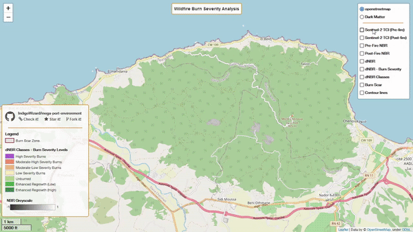

# Wildfire Burn Severity Analysis App

Open for contribution! Consider ⭐ starring the project ʕ •ᴥ•ʔ ... ʕ　·ᴥ·ʔ

Wlidfire Burn Severity Analysis Streamlit App: [https://wildfire-analysis.streamlit.app/](https://wildfire-analysis.streamlit.app/)

  

This web application leverages the Google Earth Engine API to assess and visualize wildfire burn severity. It employs the **Normalized Burn Ratio (NBR)** to evaluate the impact of wildfires on the Earth's surface and estimate the severity of the burn. With this app, users can define their Area of Interest (AOI), specify pre-fire and post-fire dates, and interactively explore the results on a map.

## App

This project is available in two distinct versions:

**Streamlit App:** https://wildfire-analysis.streamlit.app

The Streamlit app is the primary focus of this repository and can be accessed at the main [`streamlit-app branch`](https://github.com/IndigoWizard/wildfire-burn-severity/tree/streamlit-app): It offers an intuitive web-based interface, allowing users to effortlessly analyze wildfire burn severity. No Google Earth Engine account or complex setup is required. Simply visit the link and input your parameters to view the results interactively.

**Folium App:** https://indigowizard.github.io/wildfire-burn-severity/webmap.html

The original Python script version of the project resides in the [`folium-app branch`](https://github.com/IndigoWizard/wildfire-burn-severity/tree/folium-app). While this version involves running a Python script, it offers more control over code customization. This branch allows for manual customization but requires users to set up their dev environment and make adjustments to match their specific area of interest. **It is not maintained.**

Choose the version that best suits your needs.

## Use-case:

The wildifre that erupted in Mount Chenoua, Tipaza, Algeria on August 14th-16th 2022 is used as main use-case.
For more details on this wildfire, read the related medium article: [Mt Chenoua Forest Fires Analysis with Remote Sensing.](https://medium.com/@Indigo.Wizard/mt-chenoua-forest-fires-analysis-with-remote-sensing-614681f468e9)

## Preview

## Usage

- Define your AOI by uploading a GeoJSON file or manually selecting a location on the map.
- Adjust the cloud pixel rate to filter satellite images based on cloud coverage.
- Choose pre-fire and post-fire dates to compare the severity before and after the wildfire.
- Explore satellite imagery, NBR, and NDWI for a comprehensive analysis.
- Use the Layer Control to toggle between map layers.

## Features

- Upload your custom AOI using GeoJSON files.
- Pick custom dates for 
- Adjust cloud coverage settings for accurate satellite image selection.
- Explore pre-fire and post-fire satellite imagery.
- Calculate and visualize the **Normalized Burn Ratio (NBR)** and NDWI.
- View NBR and NDWI (Normalized Difference Water Index) for better analysis.
- Easily switch between map layers using the Layer Control.

## Contribution

This project is open-source and welcomes contributions so check the [Contributing Guidlines](.github/CONTRIBUTING.md). If you encounter issues or have suggestions for improvements, please feel free to [create an issue](https://github.com/IndigoWizard/wildfire-burn-severity/issues) or submit a pull request.

## Credit

The app was developped by [IndigoWizard](https://github.com/IndigoWizard) using; Streamlit, Google Earth Engine Python API, geemap, Folium. Forest icons created by <a href="https://www.flaticon.com/free-icons/forest" title="forest icons">Pomicon - Flaticon</a>
