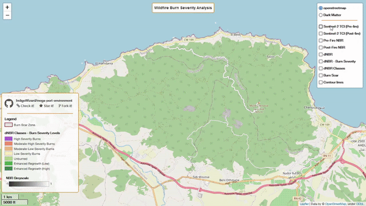
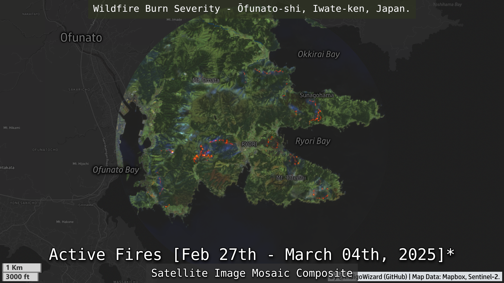
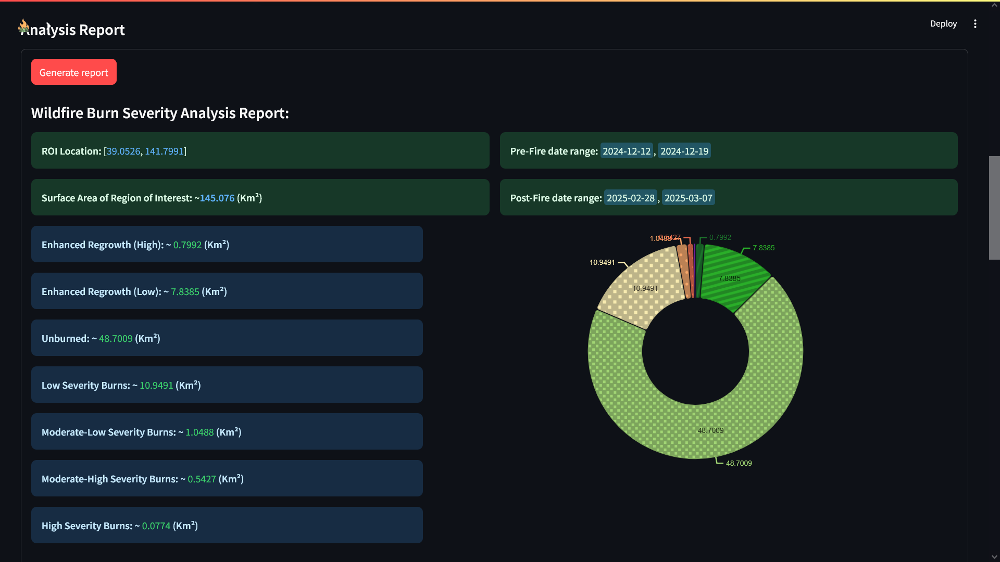
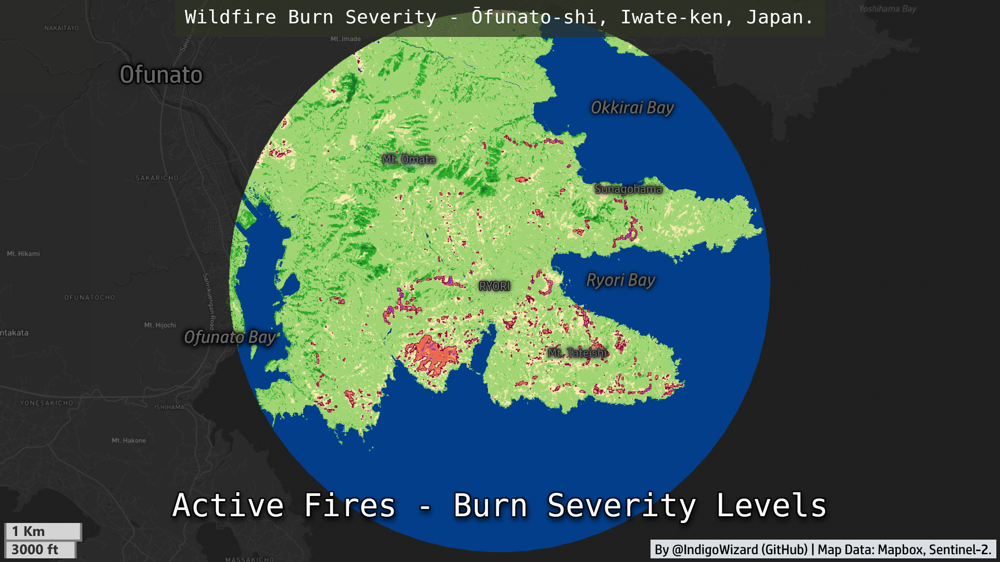
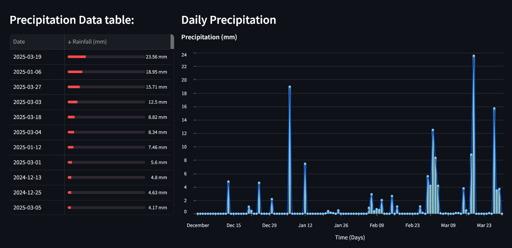
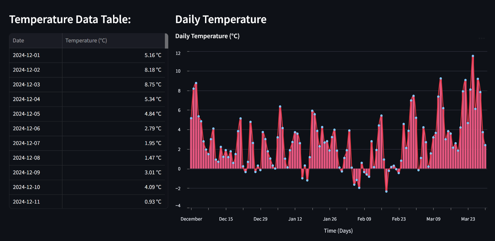

# Wildfire Burn Severity Analysis App

<p align="center">
  <a href="https://wildfire-analysis.streamlit.app"></a>
</p>

[](https://wildfire-analysis.streamlit.app/)
[](LICENSE)


This web app leverages **Google Earth Engine Python API** to assess and visualize wildfire burn severity on the map.

It computes the **Normalized Burn Ratio (NBR)** and related spectral and environmental indices to evaluate wildfire impact while also integrating **precipitation** and **temperature** datasets to provide climate context.

The app is built with **Streamlit** and requires no setup; simply open it in your browser and start analyzing on the fly! 🔗 **App link**: [https://wildfire-analysis.streamlit.app](https://wildfire-analysis.streamlit.app)

---

## Features

- **Wildfire Burn Severity Analysis**
  - Compute Normalized Burn Ratio (**NBR** & **dNBR**).
  - Compute Normalized Difference Water Index (**NDWI**).
  - Reclassified Burn Severity Levels.
  - Visualize `pre-fire` and `post-fire` Sentinel-2 imagery.
  - Explore raster and vectorized burn scar area.

- **Hydro-Climatic Context**
  - Integrates daily **precipitation data (CHIRPS v2)** with interactive tables and charts.
  - Integrates daily **air temperature data (ERA5 reanalysis)** with trend visualization.
  - Daily temperature averages derived at 2m height.  

- **Visualization & Comprehensive Reporting**
  - Interactive maps with toggleable layers (pre/post TCI, dNBR, NDWI, classified severity).  
  - Colorblind-friendly visualization palettes for better accessibility(Deuteranomaly, Protanomaly, Tritanomaly, Achromatopsia) synced across map and report.  
  - Basic info (date, centroid coordinates, surface area)
  - Statistical area calculations for each burn severity class.
  - Interactive `nivo` pie charts for data visualization.
  - Interactive `Altair` bar charts with trend line.
  - Interactive climate DataFrames.
  - Export results as CSV, PNG, or SVG for reporting and analysis.

- **User-Friendly Interface**
  - Sidebar navigation menu. 
  - Easy input parameters with widgets to adjust cloud thresholds and analysis dates.
  - Responsive layout optimized for desktop and mobile.
  - Performance optimized for large AOIs and cloud-hosted environments with form-based input system to minimize resource consumption.


## Usage

1. In the [live app](https://wildfire-analysis.streamlit.app/):
   - Define your AOI (upload or draw geojson).
   - Select pre-fire and post-fire dates.
   - Adjust the cloud coverage threshold.
2. Click "Generate Map" and explore the results on the map and in the report section.
3. Click "Generate Report" and visualize statistical results and visual charts of the data.

## Example Use Case

The app was initially validated using the **Mount Chenoua wildfire** case (Tipaza, Algeria, Aug 14–16, 2022).

[](https://medium.com/@Indigo.Wizard/mt-chenoua-forest-fires-analysis-with-remote-sensing-614681f468e9) For more details on this wildfire, read the related Medium article: 
📖 [Mt Chenoua Forest Fires Analysis with Remote Sensing.](https://medium.com/@Indigo.Wizard/mt-chenoua-forest-fires-analysis-with-remote-sensing-614681f468e9)

## Preview

|Mt. Chenoua, Algeria - 2022 Wildfire|Ōfunato-shi, Japan - 2025. Satellite Image Mosaic Composit|
|:--:|:--:|
|||
|**Global Report Stats**|**Ōfunato-shi, Japan - 2025. Burn Severity Classes**|
|||
|**Precipitation Data**|**Temperature Data**|
|||


## Development (local use)

### Setup (Conda/Mamba)

> Recommended environment management: **conda / mamba**

1. **Register for a** [Google Earth Engine account](https://earthengine.google.com/) access.

2. **Clone the repository**

```bash
git clone https://github.com/IndigoWizard/wildfire-burn-severity.git

cd wildfire-burn-severity
```

3. **Create env and install dependencies**

```bash
conda create -n wildfire python=3.13
conda activate wildfire
conda install -c conda-forge mamba
mamba install --file requirements.txt
```

4. **Run the app**

```bash
streamlit run app.py
```

### Git Flow
This project uses `git-flow`. Contributors should base their work on `streamlit-dev` and open PRs against it.

- **Main Branch:** `streamlit-main` (production)
- **Development Branch:** `streamlit-dev`
- **Feature Branches:** `feature/feature_name`
- **Release Branch:** `release/v1.x.0`
- **Hotfix Branch:** `hotfix/v1.0.x`
- **Versioning scheme:** `v1.0.0` / `v0.0.1-beta`
> - **folium-app** branch: deprecated


### Deployment
- The project is deployed on [Streamlit Community Cloud](https://docs.streamlit.io/deploy).

## Contribution

Contributions are welcome! Please read the [Contributing Guidelines](.github/CONTRIBUTING.md)

For [Pull Requests](.github/PULL_REQUEST_TEMPLATE.md):
- Make PRs against the `streamlit-dev` branch.
- Reference the related issue.
- Include visuals for UI changes when applicable.

## License

This project is licensed under the GPL-3.0 License. See [LICENSE](./LICENSE) file.

## Credits

The project and app was developped by [IndigoWizard](https://github.com/IndigoWizard) using; Python, Streamlit, Google Earth Engine Python API, Folium. ECMWF ERA5 Temperature Data, CHIRPS Precipitation Data, Sentinel-2 imagery. Forest icons created by [Pomicon - Flaticon](https://www.flaticon.com/free-icons/forest).
